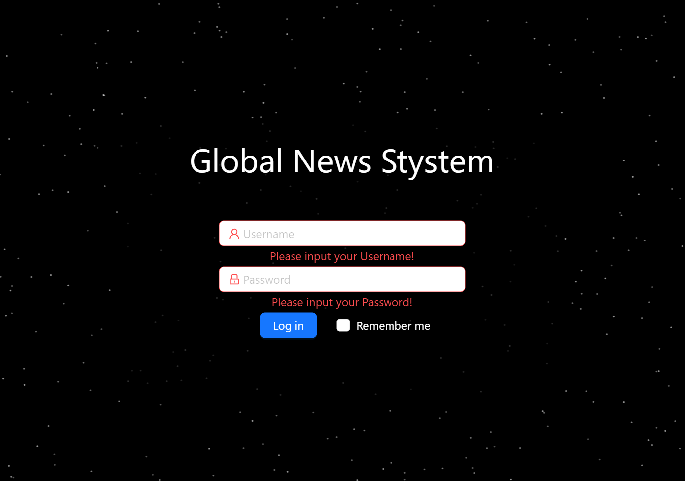
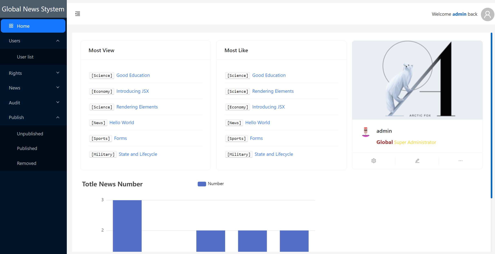
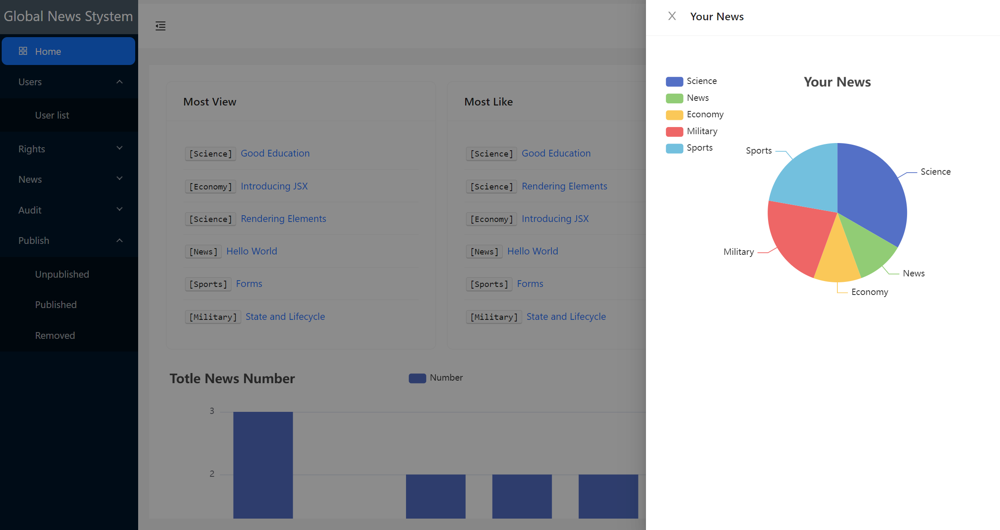

# React News System

React News System is a web application for managing and publishing news articles. It provides features such as news publishing, article management, user management, role-based permissions, and more. The application is built using React, React Router, Redux, Ant Design, ECharts, and Axios. The backend is based on JSON Server.

## Features

- News Publishing and Management
- Article Auditing
- User Management
- Role-based Permissions
- Visitor-friendly Pages

## Technologies Used

- React
- React Router
- Redux
- Ant Design
- ECharts
- Axios
- JSON Server (Backend)

## Getting Started

### Prerequisites

- Node.js (10+)
- npm or yarn

### Installation

1. Clone the repository: `git clone https://github.com/TonemonW/React-news-system.git`
2. Navigate to the project directory: `cd React-news-system`
3. Install dependencies: `npm install` or `yarn install`

### Running the Application

1. Start the JSON Server for the backend: `npm run backend` or `yarn backend`
2. Start the development server: `npm start` or `yarn start`
3. Open your browser and go to: `http://localhost:3000`

## Contributing

Contributions are welcome! If you find any issues or have suggestions for improvements, please feel free to submit a pull request or open an issue.
